# StreakSnap — Master Specification

> Daily photo streaks with friends — break it and you both lose

Generated: 2026-02-14T12:45:53.319084+00:00 | Pipeline v1.0.0

## 1. App Overview

**Name:** StreakSnap
**Tagline:** Daily photo streaks with friends — break it and you both lose
**Description:** StreakSnap combines BeReal's authenticity with Snapchat's streak mechanics and adds mutual accountability. Users create shared streaks with friends where both must post a daily photo to keep the streak alive. Miss a day? You both lose. It's the social pressure that actually works.
**Target Audience:** Gen Z and young millennials (16-28) who already use Snapchat streaks and BeReal, want lightweight social accountability, and are tired of overly monetized photo apps
**Differentiator:** The only app where streaks are mutual — your friend's commitment keeps YOUR streak alive too. This creates genuine social accountability that solo streak apps and Snapchat (where streaks are just sending anything) can't match.
**Feasibility:** moderate (12 days)
**Confidence:** 85%

## 2. Tech Stack (Fixed)

- **Mobile:** Expo SDK 54 + React Native 0.81 + NativeWind v4 + Expo Router v6
- **Backend:** Go-Fiber v2 + GORM + PostgreSQL
- **Auth:** JWT + Sign in with Apple
- **Payments:** RevenueCat
- **Deployment:** Coolify PaaS
- **Ci Cd:** EAS Build + Fastlane

## 3. Core Features

1. Shared friend streaks with mutual accountability — if one person misses, both lose the streak
2. Random daily notification window (2-hour window) to encourage authentic, in-the-moment photos
3. Daily themed photo prompts ('Show your lunch', 'Something blue', 'Your view right now')
4. Streak calendar heatmap showing your consistency history with friends
5. Push notification reminders with streak-at-risk warnings using loss aversion messaging
6. Friend feed showing today's photos from active streaks only
7. Streak recovery token (earn 1 free recovery per 30-day streak, or purchase)
8. Share streak milestones as Instagram Stories / TikTok cards

## 4. Market Research

**Market Size:** TAM: 100M+ users globally (social photo sharing app users). SAM: 10-20M users actively seeking daily photo challenge/streak features. Reasoning: BeReal alone has 1.1M+ reviews suggesting 10M+ downloads; Snapchat streaks feature has massive adoption; habit tracking with social accountability is a growing segment.
**Sentiment:** positive (3.8/5)
**Competitors:** 7
**Trends:** Authenticity over curation - users prefer real, unfiltered moments (BeReal's success), Gamification of daily habits through streaks and challenges, Social accountability for habit formation - friends keeping each other on track

### Pain Points

- **Users lose streaks despite completing daily challenges - streak tracking is unreliable across multiple apps** (severity: 9/10, freq: 8/10)
- **Excessive monetization and pay-to-win mechanics ruin user experience** (severity: 7/10, freq: 7/10)
- **App bugs and reliability issues cause frustration and abandonment** (severity: 6/10, freq: 6/10)
- **Lack of friend-based streak accountability where both parties share responsibility** (severity: 7/10, freq: 5/10)
- **Storage limitations and unexpected paywalls for basic features** (severity: 5/10, freq: 4/10)

### Competitors

| App | Rating | Reviews | Price | Strengths | Weaknesses |
|-----|--------|---------|-------|-----------|------------|
| BeReal: Photos & Friends Daily | 4.8 | 1,132,102 | free | Massive user base with high engagement, Simple, authentic photo-sharing concept | No explicit streak tracking system, Limited gamification features |
| Photo Roulette | 4.7 | 107,958 | freemium | Fun social game mechanic, Uses existing photos from phones | Premium pricing complaints, Not focused on daily streaks |
| GuruShots: Photography Game | 4.4 | 5,167 | freemium | Large photography community (7M+ users), Gamified photography experience | Aggressive monetization, Buggy and unreliable |
| LiveIn - Share Your Moment | 4.7 | 30,509 | free | Widget integration for easy sharing, Camera-first experience | No streak gamification, Limited challenge features |
| Selfie A Day - Everyday Photo | 4.7 | 3,879 | free | Simple daily selfie tracking, Time-lapse video creation | Solo experience only, No social/friend features |
| Retro — Photos with Friends | 4.8 | 3,300 | free | Editors' Choice recognition, Friend-focused photo sharing | Smaller user base, Limited public reviews for analysis |
| Streaks | 4.5 | 0 | paid | Elegant design for Apple ecosystem, One-time purchase ($6.99) | Apple-only ecosystem, Not photo-specific |

## 5. Design System

**Style:** OLED Dark with Glassmorphism and AI Gradient Haze accents — A photo-first, dark-optimized design that makes user photos pop against true black backgrounds. Glassmorphic overlays create depth without distraction, while warm gradient accents (fire orange to electric violet) energize the streak experience. Bento grid layouts organize the friend feed with visual hierarchy.

### Colors

| Token | Hex | Usage |
|-------|-----|-------|
| streak_fire | `#FF6B35` | Primary brand color, streak flames, active streak indicators, key CTAs |
| electric_violet | `#8B5CF6` | Secondary accent, gradient endpoints, premium features, celebration moments |
| pulse_blue | `#3B82F6` | Notification badges, links, interactive elements, 'post now' urgency |
| success_green | `#10B981` | Completed daily posts, streak milestones achieved, positive states |
| warning_amber | `#F59E0B` | Streak at-risk warnings, 30-minute remaining alerts, caution states |
| danger_red | `#EF4444` | Broken streaks, missed posts, critical alerts, loss indicators |
| oled_black | `#050505` | Primary background, OLED deep dark mode base |
| surface_dark | `#121212` | Elevated cards, glassmorphism base, modal backgrounds |
| surface_elevated | `#1E1E1E` | Input fields, buttons (secondary), navigation bars |
| text_primary | `#FAFAFA` | Main headings, streak numbers, primary text on dark |
| text_secondary | `#A3A3A3` | Captions, timestamps, secondary information |
| text_muted | `#737373` | Placeholder text, disabled states, tertiary info |
| glass_white | `#FFFFFF` | Glassmorphism overlay (8% opacity), borders, dividers |
| gradient_haze_start | `#FF6B35` | AI gradient haze start - streak celebration, onboarding |
| gradient_haze_end | `#EC4899` | AI gradient haze end - blends with violet for dreamy effects |

### Dark Mode Overrides

| Token | Hex | Usage |
|-------|-----|-------|
| oled_black | `#050505` | Primary background (true black for OLED power savings) |
| surface_dark | `#121212` | Elevated surfaces, cards, modals |
| surface_elevated | `#1E1E1E` | Highest elevation, input fields, buttons |
| glass_overlay | `#FFFFFF` | 8% opacity overlay for glassmorphism effect |
| border_subtle | `#FFFFFF` | 12% opacity for subtle borders and dividers |
| gradient_fire_glow | `#FF6B35` | 20% opacity glow behind active streak elements |

### Typography

- **streak_hero:** 72px bold, line-height: 0.9
- **display_large:** 36px bold, line-height: 1.1
- **heading1:** 24px semibold, line-height: 1.2
- **heading2:** 20px semibold, line-height: 1.3
- **body:** 16px normal, line-height: 1.5
- **body_medium:** 15px medium, line-height: 1.4
- **caption:** 13px normal, line-height: 1.4
- **micro:** 11px medium, line-height: 1.2

### Component Styles

- **streak_card:** radius=20px, padding=`p-4`, shadow=`shadow-lg shadow-streak_fire/10` Glassmorphism with backdrop-blur-xl, gradient border for active streaks, haptic pulse on tap
- **photo_frame:** radius=16px, padding=`p-1`, shadow=`shadow-md shadow-black/50` Gradient border (fire to violet) for posted photos, subtle inner shadow for depth
- **button_primary:** radius=9999px, padding=`px-8 py-4`, shadow=`shadow-lg shadow-streak_fire/30` Gradient background (fire to pink), min 44px height, haptic-visual sync on press
- **button_secondary:** radius=9999px, padding=`px-6 py-3`, shadow=`` Glassmorphism with border, transparent background, 1px white/20 border
- **button_urgent:** radius=16px, padding=`px-6 py-4`, shadow=`shadow-xl shadow-warning_amber/40` Pulsing animation, amber gradient, used for 'post now' CTA when streak at risk
- **input_field:** radius=12px, padding=`px-4 py-3`, shadow=`` Glassmorphism background, no visible border, placeholder in text_muted
- **modal_sheet:** radius=24px, padding=`p-6`, shadow=`shadow-2xl shadow-black/60` Bottom sheet style, glassmorphism with heavy blur, drag handle at top
- **heatmap_cell:** radius=4px, padding=``, shadow=`` 4x4px cells in bento grid, opacity varies by streak activity (0.1 to 1.0)
- **friend_avatar:** radius=9999px, padding=``, shadow=`shadow-md shadow-black/40` Ring border shows streak status: green=posted, amber=pending, red=missed
- **badge:** radius=9999px, padding=`px-3 py-1`, shadow=`` Small status indicators, glassmorphism, micro typography
- **toast_notification:** radius=12px, padding=`px-4 py-3`, shadow=`shadow-lg shadow-black/30` Slides from top, glassmorphism, auto-dismiss after 3s, haptic tap
- **bento_card:** radius=16px, padding=`p-4`, shadow=`shadow-sm shadow-black/20` Grid cells for friend feed, varying sizes (1x1, 2x1, 1x2), glassmorphism

### Design Notes

- OLED Deep Dark is the primary mode — true black (#050505) backgrounds maximize photo visibility and save battery on OLED screens
- Glassmorphism implemented via backdrop-blur-xl with 8% white overlay — creates depth without obscuring photos
- AI Gradient Haze used for celebration moments (streak milestones) — fire orange to electric pink creates warm, energetic glow
- Bento Grid layout for friend feed — asymmetric grid (2+1, 1+2 patterns) creates visual interest while maintaining scannability
- Streak numbers use 72px bold typography — creates 'gamification' moment that rewards consistency
- Heatmap calendar uses opacity-based cells — darker cells = posted days, creates satisfying visual of consistency
- All touch targets minimum 48x48px — exceeds 44px WCAG minimum for better mobile ergonomics
- Haptic-visual sync: fire gradient pulses with light haptic on streak-at-risk warnings
- Status ring on friend avatars: green ring = posted today, amber = pending, red = missed — instant visual accountability
- No pure white text (#FFFFFF) — using #FAFAFA reduces eye strain on OLED in low-light conditions
- Gradient CTAs (fire to pink) create urgency and warmth — differentiates from cool-toned competitors
- Premium features use electric violet accent — subtle visual hierarchy without paywall friction

## 6. UX Architecture

**Navigation:** custom_tab_bar

### Tab Bar

| Label | Icon | Route |
|-------|------|-------|
| Home | home | home |
| Camera | camera | camera |
| Friends | people | friends |
| Profile | person | profile |

### Screens

#### index
- **Route:** `app/index.tsx`
- **Description:** Smart router: checks AsyncStorage for onboarding completion, then auth state. Routes to onboarding (first launch), guest-home (no account), or protected home (authenticated). No UI — pure redirect logic.
- **Components:** ActivityIndicator, useEffect redirect logic

#### onboarding
- **Route:** `app/(auth)/onboarding.tsx`
- **Description:** 3-step horizontal swipeable onboarding. Step 1: Lottie animation of two phones snapping photos simultaneously — headline 'Streak Together' — subtext 'Daily photo streaks with your best friends. Miss a day? You both lose.' Step 2: Illustration of notification bell with clock — headline 'Stay Real' — subtext 'Random 2-hour windows keep your photos authentic and in-the-moment.' Step 3: Calendar heatmap illustration — headline 'Build Your Legacy' — subtext 'Watch your streak calendar grow. Earn recovery tokens at 30-day milestones.' Bottom: dot indicators (#FFFFFF 8px circles, active dot #FF6B35), 'Get Started' button on step 3 (#FF6B35 bg, #FFFFFF text, rounded-2xl, h-14). Skip link on steps 1-2 (text-white/60).
- **Components:** ScrollView horizontal pagingEnabled, Animated.View for dot indicators, Pressable 'Get Started', Pressable 'Skip', LottieView or Image per step

#### login
- **Route:** `app/(auth)/login.tsx`
- **Description:** Dark login screen (#0A0A0A bg). Top: StreakSnap logo (flame icon 🔥 + wordmark in #FF6B35, 32px). Email input (bg-white/10 border border-white/20 rounded-xl h-12 px-4 text-white placeholder-white/40). Password input same style with eye toggle. 'Log In' button (#FF6B35 bg, w-full h-14 rounded-2xl, font-bold text-white text-lg). Divider '— or —' in text-white/30. Apple Sign In button (bg-white text-black h-14 rounded-2xl with Apple logo). Bottom: 'Don't have an account? Sign Up' link (text-white/60, 'Sign Up' in text-[#FF6B35]).
- **Components:** TextInput email, TextInput password, Pressable 'Log In', AppleSignInButton, Pressable navigate to register, KeyboardAvoidingView
- **API Calls:** POST /api/auth/login, POST /api/auth/apple

#### register
- **Route:** `app/(auth)/register.tsx`
- **Description:** Dark registration screen (#0A0A0A bg). Top: 'Join StreakSnap' text (text-white text-2xl font-bold). Username input (bg-white/10, validates uniqueness on blur via API, shows green checkmark or red X). Email input. Password input with strength indicator (4 bars: weak #EF4444, fair #F59E0B, good #22C55E, strong #22C55E). Confirm password input. 'Create Account' button (#FF6B35 bg h-14 rounded-2xl). Apple Sign In button. Bottom: 'Already have an account? Log In' link. After success: auto-login + navigate to protected home with confetti animation.
- **Components:** TextInput username, TextInput email, TextInput password, TextInput confirmPassword, PasswordStrengthBar, Pressable 'Create Account', AppleSignInButton, ConfettiCannon on success
- **API Calls:** POST /api/auth/register, GET /api/auth/check-username/:username

#### guest-home
- **Route:** `app/(auth)/guest-home.tsx`
- **Description:** Limited guest experience (#0A0A0A bg). Top: 'StreakSnap' logo + 'Guest Mode' badge (bg-white/10 rounded-full px-3 py-1 text-xs text-white/60). UsageBadge showing '3 free peeks remaining' or '2 remaining' etc (bg-[#FF6B35]/20 text-[#FF6B35]). Sample streak feed with 3 blurred placeholder photos (BlurView intensity 80) showing mock streak data. Each card: blurred photo + '🔥 12 day streak' overlay + 'Sign up to start your own streaks' CTA. Bottom CTA banner: gradient bg (#FF6B35 to #FF8C61), 'Start Your First Streak' button (bg-white text-[#FF6B35] h-12 rounded-xl font-bold). Tapping any blurred photo decrements guest counter; at 0 shows signup modal.
- **Components:** UsageBadge, BlurView placeholder cards, CTABanner gradient, Pressable 'Start Your First Streak', Modal signup prompt at 0 uses

#### protected-layout
- **Route:** `app/(protected)/_layout.tsx`
- **Description:** Auth guard layout. Checks isAuthenticated from AuthContext — if false, redirects to login. Renders Slot (NOT Stack or Tabs) + custom bottom tab bar. Tab bar: bg-[#0A0A0A] border-t border-white/10 h-20 pb-6 pt-2 flex-row justify-around items-center. 4 tab items. Active tab: icon #FF6B35 + label text-[#FF6B35] text-xs font-semibold. Inactive: icon #FFFFFF60 + label text-white/40 text-xs. Haptic feedback (light impact) on tab press.
- **Components:** Slot, View custom tab bar, Pressable tab items x4, Ionicons per tab, expo-haptics light impact

#### home
- **Route:** `app/(protected)/home.tsx`
- **Description:** Main feed screen (#0A0A0A bg). Top bar: 'StreakSnap' wordmark (text-[#FF6B35] text-xl font-bold) left, notification bell icon (Ionicons 'notifications-outline' 24px white) right with red dot badge if unread. If inside active notification window: orange pulsing banner at top — '📸 Snap window open! 1h 23m left' (bg-[#FF6B35]/20 text-[#FF6B35] rounded-xl mx-4 p-3, Animated.View pulsing opacity 0.7↔1.0). Today's prompt card below banner: bg-white/5 rounded-2xl p-4 mx-4 — prompt text in text-white text-lg font-semibold (e.g., 'Show your lunch 🍕'), subtext 'Tap to snap' in text-white/50. Active streaks feed (FlatList vertical): each card is StreakFeedCard — friend's photo (w-full aspect-[4/3] rounded-2xl), below: Row with friend avatar (32px circle), username (text-white font-semibold), streak count badge ('🔥 47' in bg-[#FF6B35]/20 text-[#FF6B35] rounded-full px-3 py-1), time ago (text-white/40 text-xs). If friend hasn't posted yet today: grayed placeholder with '⏳ Waiting for @username'. If YOU haven't posted: your card slot shows camera icon + 'Your turn! Snap now' in text-[#FF6B35]. Empty state (no streaks): illustration + 'Add friends to start streaking' + 'Add Friends' button.
- **Components:** FlatList StreakFeedCard, PromptCard, SnapWindowBanner animated, NotificationBell with badge, EmptyState illustration
- **API Calls:** GET /api/streaks/feed, GET /api/prompts/today, GET /api/notifications/unread-count

#### camera
- **Route:** `app/(protected)/camera.tsx`
- **Description:** Full-screen camera capture (#000000 bg). Top: back arrow (Ionicons 'chevron-back' white 28px) left, flash toggle (Ionicons 'flash-outline'/'flash' 24px) right, camera flip (Ionicons 'camera-reverse-outline' 24px) far right. Center: live camera preview (expo-camera, aspect ratio 4:3, rounded-3xl overflow hidden mx-4). Today's prompt floating at top of preview in semi-transparent pill (bg-black/50 backdrop-blur rounded-full px-4 py-2 text-white text-sm font-medium). Bottom: large capture button (w-20 h-20 rounded-full border-4 border-white, inner circle w-16 h-16 rounded-full bg-white). Scale animation on press (0.9→1.0). After capture: preview with 'Retake' (text-white/60) and 'Send' (#FF6B35 bg rounded-2xl h-12 px-8) buttons. Streak selector: horizontal ScrollView of friend avatars with checkmarks to select which streaks to send to. 'Send to All' shortcut button.
- **Components:** Camera expo-camera, Pressable capture button with Animated.View, Pressable flash toggle, Pressable camera flip, Image preview after capture, ScrollView friend selector, Pressable 'Send' / 'Retake'
- **API Calls:** POST /api/streaks/snap (multipart/form-data), GET /api/streaks/active

#### friends
- **Route:** `app/(protected)/friends.tsx`
- **Description:** Friends management screen (#0A0A0A bg). Top: 'Friends' title (text-white text-2xl font-bold) left, 'Add' button (Ionicons 'person-add-outline' 24px #FF6B35) right. Search bar (bg-white/10 rounded-xl h-11 px-4 text-white placeholder-white/40, Ionicons 'search' 20px white/40 left). Tabs row below search: 'Active Streaks' | 'All Friends' | 'Requests' (active tab: text-[#FF6B35] border-b-2 border-[#FF6B35], inactive: text-white/50). Active Streaks tab: FlatList of FriendStreakCard — Row with avatar (44px circle), username (text-white font-semibold), streak fire + count ('🔥 23'), streak status pill (green 'Both posted' / yellow 'Waiting on you' / red 'At risk — 2h left'). Swipe left on card reveals 'Nudge 👉' action (bg-[#FF6B35]). All Friends tab: simple list with avatar, username, 'Start Streak' button (border border-[#FF6B35] text-[#FF6B35] rounded-full px-4 py-1). Requests tab: incoming requests with Accept/Decline buttons. Add friend modal: search by username, shows results, send request button.
- **Components:** TextInput search, Pressable tab selectors, FlatList FriendStreakCard, Swipeable 'Nudge', Modal add friend, Pressable 'Accept'/'Decline' requests
- **API Calls:** GET /api/friends, GET /api/friends/requests, POST /api/friends/request, PUT /api/friends/request/:id/accept, DELETE /api/friends/request/:id/decline, POST /api/friends/nudge/:friendId, GET /api/friends/search?q=username

#### streak-detail
- **Route:** `app/(protected)/streak/[id].tsx`
- **Description:** Detailed streak view with a specific friend (#0A0A0A bg). Top: back arrow + friend avatar (48px) + username (text-white font-bold text-lg) + streak badge ('🔥 47 days' bg-[#FF6B35]/20 text-[#FF6B35] rounded-full px-3 py-1). Stats row below: 'Longest: 89' | 'Recoveries: 1' | 'Photos: 214' (each in bg-white/5 rounded-xl p-3, number in text-white text-xl font-bold, label in text-white/50 text-xs). Calendar heatmap section: 'Streak Calendar' header. Grid of last 90 days (7 columns for weekdays). Each cell is 36x36 rounded-lg. Colors: no photo #1C1C1E, your photo only #FF6B35/30, friend only #FF6B35/30, both posted #FF6B35, streak broken #EF4444/30. Month labels at top (text-white/30 text-xs). Photo timeline below calendar: vertical list of date sections. Each date header (text-white/60 text-sm). Side-by-side photos (your photo left, friend right, each w-[48%] aspect-square rounded-xl). Tapping a photo opens full-screen modal. Recovery token section at bottom if streak is at risk: 'Streak at risk! Use recovery token?' — 'Use Token (1 remaining)' button (#FF6B35 bg) or 'Buy Token' if none available.
- **Components:** Image friend avatar, StatsRow, CalendarHeatmap custom component, FlatList photo timeline, Modal full-screen photo viewer, Pressable 'Use Recovery Token', Pressable 'Buy Token'
- **API Calls:** GET /api/streaks/:id, GET /api/streaks/:id/calendar, GET /api/streaks/:id/photos?page=1, POST /api/streaks/:id/recover

#### profile
- **Route:** `app/(protected)/profile.tsx`
- **Description:** User profile and stats (#0A0A0A bg). Top: 'Profile' title left, settings gear (Ionicons 'settings-outline' 24px white) right. Avatar section: large avatar (80px circle, border-2 border-[#FF6B35]), tap to change (camera/gallery action sheet). Username below (text-white text-xl font-bold). '@username' handle (text-white/50). Stats cards row: 'Active Streaks' (count in text-[#FF6B35] text-3xl font-bold), 'Longest Streak' (count), 'Total Snaps' (count) — each in bg-white/5 rounded-2xl p-4 flex-1. Achievements section: 'Achievements' header (text-white text-lg font-bold). Horizontal ScrollView of achievement badges: '7 Day Warrior' (bronze ring), '30 Day Legend' (silver ring), '100 Day Immortal' (gold ring), 'First Recovery' (shield icon), 'Prompt Master' (camera icon). Locked achievements are grayscale with lock overlay. Recovery Tokens section: 'Recovery Tokens' header. Count display (text-[#FF6B35] text-4xl font-bold) + 'tokens available'. 'Earn 1 token every 30-day streak milestone' subtext. 'Buy More Tokens' button (border border-[#FF6B35] text-[#FF6B35] rounded-xl h-11). Milestone sharing: 'Share Your Stats' button → generates Instagram Story / TikTok card with stats overlay on gradient background (#FF6B35 → #FF3D00). Bottom: full calendar heatmap of ALL streaks combined (365 days).
- **Components:** Image avatar with edit overlay, StatsCardRow, ScrollView AchievementBadge, RecoveryTokenDisplay, Pressable 'Buy More Tokens', Pressable 'Share Your Stats', CalendarHeatmap yearly, Pressable settings gear
- **API Calls:** GET /api/users/me/profile, GET /api/users/me/achievements, GET /api/users/me/stats, GET /api/users/me/calendar, PUT /api/users/me/avatar (multipart/form-data)

#### settings
- **Route:** `app/(protected)/settings.tsx`
- **Description:** Settings screen (#0A0A0A bg). Section groups with headers (text-white/50 text-xs uppercase tracking-wider mb-2 mt-6 px-4). Account section: 'Edit Profile' row (navigate to edit-profile), 'Notification Preferences' row (navigate to notification-settings). Subscription section: current plan badge ('Free' in text-white/50 or 'Pro' in text-[#FF6B35]) + 'Manage Subscription' row. 'Restore Purchases' row (triggers RevenueCat restore). Privacy section: 'Privacy Policy' row, 'Terms of Service' row. Support section: 'Help & FAQ' row, 'Contact Us' row (opens email). Danger zone section: 'Log Out' row (text-[#EF4444], confirmation alert). 'Delete Account' row (text-[#EF4444], requires password modal → calls DELETE /api/auth/account). Each row: bg-white/5 h-14 px-4 flex-row items-center justify-between, text-white, chevron-right icon (Ionicons 'chevron-forward' 20px white/30). Rows grouped with rounded-2xl overflow hidden.
- **Components:** Pressable setting rows, Alert confirmation for logout, Modal password confirmation for delete, Pressable 'Restore Purchases'
- **API Calls:** POST /api/auth/logout, DELETE /api/auth/account, RevenueCat restorePurchases()

#### paywall
- **Route:** `app/(protected)/paywall.tsx`
- **Description:** Pro subscription paywall (#0A0A0A bg). Triggered contextually: after streak break (recovery upsell), at 4th friend add (streak limit), or from settings. Top: close X button (Ionicons 'close' 28px white) right. Hero section: gradient background (#FF6B35 → #FF3D00 → transparent) top 40% of screen. Large emoji/illustration of fire + shield. Headline: 'Never Lose a Streak Again' (text-white text-2xl font-bold text-center). Subtext: 'StreakSnap Pro gives you the tools to keep every streak alive' (text-white/70 text-center). Feature list with checkmarks: '✅ Unlimited active streaks' / '✅ 3 recovery tokens per month' / '✅ Custom photo prompts' / '✅ Streak analytics & insights' / '✅ Ad-free experience' — each row: Ionicons 'checkmark-circle' 24px #22C55E + text-white text-base. Pricing cards (3 options): Weekly $2.99/wk (bg-white/5 border border-white/10 rounded-2xl p-4), Monthly $4.99/mo (bg-white/5 border-2 border-[#FF6B35] rounded-2xl p-4, 'POPULAR' badge bg-[#FF6B35] text-white text-xs rounded-full px-2 py-0.5), Annual $39.99/yr (bg-white/5 border border-white/10 rounded-2xl p-4, 'SAVE 38%' badge). Selected card: border-[#FF6B35] scale 1.02. 'Subscribe' button (bg-[#FF6B35] h-14 rounded-2xl w-full text-white font-bold text-lg). 'Restore Purchases' link (text-white/50 text-sm). Legal text at bottom (text-white/30 text-xs, auto-renew disclaimer).
- **Components:** LinearGradient hero, FeatureCheckmarkList, Pressable PricingCard x3, Pressable 'Subscribe', Pressable 'Restore Purchases', Pressable close X
- **API Calls:** RevenueCat getOfferings(), RevenueCat purchasePackage(), RevenueCat restorePurchases()

#### notifications
- **Route:** `app/(protected)/notifications.tsx`
- **Description:** Notification center (#0A0A0A bg). Top: 'Notifications' title (text-white text-2xl font-bold) + 'Mark All Read' link (text-[#FF6B35] text-sm). FlatList of notification items. Types: streak_snap (friend posted — avatar + 'Sarah sent a snap in your streak 🔥' + time ago), streak_risk ('⚠️ Your streak with Jake expires in 2 hours!' — bg-[#EF4444]/10 border-l-4 border-[#EF4444]), streak_broken ('💔 Your 23-day streak with Emma broke' — bg-[#EF4444]/10), streak_milestone ('🎉 30-day streak with Alex! You earned a recovery token' — bg-[#22C55E]/10), friend_request ('👋 Mike wants to be friends' + Accept/Decline buttons), nudge ('👉 Sarah nudged you! Time to snap'). Each item: bg-white/5 rounded-xl p-4 mx-4 mb-2. Unread items have left border-2 border-[#FF6B35]. Tapping navigates to relevant screen. Pull-to-refresh. Empty state: bell icon + 'No notifications yet'.
- **Components:** FlatList NotificationItem, Pressable per notification, RefreshControl pull-to-refresh, Pressable 'Mark All Read', EmptyState
- **API Calls:** GET /api/notifications?page=1, PUT /api/notifications/read-all, PUT /api/notifications/:id/read

#### share-milestone
- **Route:** `app/(protected)/share-milestone/[streakId].tsx`
- **Description:** Milestone sharing screen for generating Instagram/TikTok cards (#0A0A0A bg). Top: back arrow + 'Share Milestone' title. Card preview (ViewShot for screenshot capture): gradient background (#FF6B35 → #FF3D00), center: '🔥' large emoji (64px), streak count in massive text (text-white text-6xl font-bold), 'DAY STREAK' subtitle (text-white/80 text-xl), your avatar + friend avatar side by side (48px circles with white border), '@you & @friend' names below, 'StreakSnap' watermark at bottom (text-white/40 text-sm). Card style selector: horizontal ScrollView of 4 card template thumbnails (gradient variations: orange, purple #7C3AED→#4F46E5, green #22C55E→#166534, dark #1C1C1E→#0A0A0A). 'Share to Instagram Stories' button (bg-gradient-to-r from-purple-500 to-pink-500 h-14 rounded-2xl). 'Share to TikTok' button (bg-black border border-white/20 h-14 rounded-2xl). 'Save to Photos' button (bg-white/10 h-14 rounded-2xl). 'Copy Link' button (bg-white/10 h-12 rounded-xl).
- **Components:** ViewShot card preview, LinearGradient card backgrounds, ScrollView template selector, Pressable 'Share to Instagram', Pressable 'Share to TikTok', Pressable 'Save to Photos', Pressable 'Copy Link'
- **API Calls:** GET /api/streaks/:streakId/milestone-data

#### notification-settings
- **Route:** `app/(protected)/notification-settings.tsx`
- **Description:** Notification preferences screen (#0A0A0A bg). Top: back arrow + 'Notifications' title. Section: 'Snap Window' — 'Window alerts' toggle (when snap window opens), 'Window closing soon' toggle (30min before window closes). Section: 'Streaks' — 'Streak at risk' toggle (2h before expiry), 'Streak broken' toggle, 'Friend posted' toggle, 'Milestone reached' toggle. Section: 'Social' — 'Friend requests' toggle, 'Nudges' toggle. Each toggle row: bg-white/5 h-14 px-4 flex-row items-center justify-between rounded-xl mb-2. Label text-white, Switch trackColor inactive #3A3A3C active #FF6B35, thumbColor white. Section headers: text-white/50 text-xs uppercase tracking-wider mb-2 mt-6.
- **Components:** Switch toggles per notification type, View section groups
- **API Calls:** GET /api/users/me/notification-preferences, PUT /api/users/me/notification-preferences

### User Flows

- **onboarding:** index → onboarding → guest-home OR register/login
  First launch: index checks AsyncStorage 'onboarding_complete'. If false → onboarding screen (3 swipeable steps). After onboarding, user can 'Get Started' → register screen, or 'Continue as Guest' → guest-home with 3 free peeks. Guest-home blurred cards entice signup. At 0 remaining uses, modal forces register/login.
- **authentication:** login → register → protected-layout/home
  Login with email/password or Apple Sign In. Register with username uniqueness check + password strength. Both flows → auto-navigate to protected/home. Refresh token rotation handled by Axios interceptor in lib/api.ts. Token stored in expo-secure-store.
- **daily-snap:** home (see prompt + window banner) → camera (capture photo) → camera (select friends to send to) → home (see updated feed)
  Core loop: User sees today's prompt on home screen. If snap window is active, pulsing orange banner shows remaining time. User taps prompt card or camera tab → camera screen with live preview + today's prompt overlay. After capture, user selects which streak friends to send to (or 'Send to All'). Photo uploads via multipart POST. Returns to home feed where their snap now appears in friend cards. Friends who haven't posted yet show '⏳ Waiting' placeholder.
- **streak-management:** friends (view active streaks) → streak-detail/[id] (calendar + photos) → share-milestone/[streakId] (share card)
  From friends tab, user sees all active streaks with status pills (both posted / waiting / at risk). Tapping a streak → streak detail screen with calendar heatmap, photo timeline, stats, and recovery token option. At milestones (7, 30, 100 days), user can navigate to share-milestone to generate and share Instagram/TikTok cards. If streak is at risk, recovery token prompt appears.
- **friend-management:** friends (search/add) → friends (accept requests) → friends (start streak)
  User taps add icon → modal with username search. Send friend request. Recipient sees request in 'Requests' tab + push notification. After accepting, either user can tap 'Start Streak' to initiate a new streak. Existing friends visible in 'All Friends' tab. Active streaks shown in 'Active Streaks' tab with swipe-to-nudge.
- **streak-recovery:** notification (streak at risk) → streak-detail/[id] → recovery confirmation OR paywall
  When streak is about to break (2h before window closes and one person hasn't posted), both users get push notification with loss aversion copy ('Your 47-day streak with Sarah is about to break! 😱'). User opens streak detail. If they have a recovery token (earned 1 per 30-day milestone), they can use it to save the streak. If no tokens, 'Buy Token' navigates to paywall. Recovery extends the window by 24 hours for that specific streak.
- **settings-and-account:** profile (tap gear icon) → settings → notification-settings OR paywall OR delete-account
  From profile screen, gear icon → settings. Sections for account management, subscription (with restore purchases), notification preferences, privacy/legal, and danger zone (logout + delete account with password confirmation). Delete account requires modal password entry then calls DELETE /api/auth/account.
- **contextual-paywall:** trigger moment → paywall → subscribe OR dismiss
  Paywall appears at high-value 'win' moments for maximum conversion: (1) After a streak breaks — 'Never lose a streak again' with recovery token highlight, (2) When trying to add 4th active streak on free plan — 'Unlimited streaks with Pro', (3) From settings — 'Manage Subscription'. Each trigger passes context to paywall for personalized headline. 3 pricing tiers: weekly $2.99, monthly $4.99 (highlighted), annual $39.99 (38% savings). RevenueCat handles purchase + receipt validation → backend webhook updates subscription status.

### Flow Diagram

```mermaid
graph TD
    A[App Launch - index.tsx] -->|First Launch| B[Onboarding 3 Steps]
    A -->|Returning + No Auth| C[Guest Home]
    A -->|Authenticated| D[Protected Home]
    
    B -->|Get Started| E[Register]
    B -->|Skip → Guest| C
    C -->|3 uses exhausted| F[Login / Register Modal]
    C -->|Sign Up CTA| E
    
    E -->|Success + Auto-login| D
    F -->|Login| G[Login]
    G -->|Success| D
    F -->|Register| E
    G -->|Apple Sign In| D
    E -->|Apple Sign In| D
    
    D -->|See Today's Prompt| H[Camera]
    D -->|Tap Notification Bell| I[Notifications]
    D -->|Tab: Friends| J[Friends]
    D -->|Tab: Profile| K[Profile]
    
    H -->|Capture + Select Friends| H2[Send Snap]
    H2 -->|Upload Success| D
    
    J -->|Tap Streak| L[Streak Detail]
    J -->|Add Friend| J2[Search + Send Request]
    J -->|Accept Request| J3[Start Streak]
    J -->|Swipe Nudge| J4[Send Nudge Push]
    
    L -->|View Calendar Heatmap| L
    L -->|Streak at Risk| M{Has Recovery Token?}
    M -->|Yes| N[Use Token - Extend 24h]
    M -->|No| O[Paywall - Buy Token]
    L -->|Milestone Reached| P[Share Milestone Card]
    P -->|Instagram Stories| P2[Share]
    P -->|TikTok| P3[Share]
    P -->|Save to Photos| P4[Save]
    
    K -->|Gear Icon| Q[Settings]
    K -->|Share Stats| P
    Q -->|Notification Prefs| R[Notification Settings]
    Q -->|Manage Subscription| O
    Q -->|Logout| G
    Q -->|Delete Account| S[Password Modal → DELETE]
    
    I -->|Streak at Risk| L
    I -->|Friend Posted| D
    I -->|Friend Request| J
    I -->|Milestone| P
    
    O -->|Subscribe| T[RevenueCat Purchase]
    T -->|Success| D
    O -->|Restore| T2[RevenueCat Restore]
```

## 7. Backend Specification

### GORM Models

**User**
  {'ID': 'uuid;default:gen_random_uuid();primaryKey', 'Email': 'string;uniqueIndex;not null', 'PasswordHash': 'string', 'AppleUserID': 'string;uniqueIndex;default:null', 'DisplayName': 'string;size:50;not null', 'AvatarURL': 'string;default:null', 'IsPremium': 'bool;default:false', 'RecoveryTokens': 'int;default:0', 'PushToken': 'string;default:null', 'NotificationWindowStart': 'int;default:10;comment:hour of day 0-23 for notification window', 'TimezoneOffset': 'int;default:0;comment:UTC offset in minutes', 'CreatedAt': 'time.Time', 'UpdatedAt': 'time.Time', 'DeletedAt': 'gorm.DeletedAt;index'}

**RefreshToken**
  {'ID': 'uuid;default:gen_random_uuid();primaryKey', 'UserID': 'uuid;not null;index', 'TokenHash': 'string;uniqueIndex;not null', 'ExpiresAt': 'time.Time;not null', 'CreatedAt': 'time.Time', 'DeletedAt': 'gorm.DeletedAt;index'}

**Friendship**
  {'ID': 'uuid;default:gen_random_uuid();primaryKey', 'RequesterID': 'uuid;not null;index', 'ReceiverID': 'uuid;not null;index', 'Status': 'string;size:20;default:pending;comment:pending|accepted|declined|blocked', 'CreatedAt': 'time.Time', 'UpdatedAt': 'time.Time', 'DeletedAt': 'gorm.DeletedAt;index'}

**Streak**
  {'ID': 'uuid;default:gen_random_uuid();primaryKey', 'UserAID': 'uuid;not null;index', 'UserBID': 'uuid;not null;index', 'CurrentCount': 'int;default:0', 'LongestCount': 'int;default:0', 'LastCompletedDate': 'string;size:10;comment:YYYY-MM-DD', 'Status': 'string;size:20;default:active;comment:active|broken|recovered', 'BrokenByUserID': 'uuid;default:null;comment:who missed the photo', 'RecoveryUsed': 'bool;default:false', 'StartedAt': 'time.Time;not null', 'BrokenAt': 'time.Time;default:null', 'CreatedAt': 'time.Time', 'UpdatedAt': 'time.Time', 'DeletedAt': 'gorm.DeletedAt;index'}

**DailyPhoto**
  {'ID': 'uuid;default:gen_random_uuid();primaryKey', 'UserID': 'uuid;not null;index', 'StreakID': 'uuid;not null;index', 'PromptID': 'uuid;default:null', 'PhotoURL': 'string;not null', 'ThumbnailURL': 'string;default:null', 'PhotoDate': 'string;size:10;not null;comment:YYYY-MM-DD', 'CapturedAt': 'time.Time;not null;comment:actual capture timestamp', 'Caption': 'string;size:200;default:null', 'CreatedAt': 'time.Time', 'DeletedAt': 'gorm.DeletedAt;index'}

**DailyPrompt**
  {'ID': 'uuid;default:gen_random_uuid();primaryKey', 'PromptText': 'string;size:100;not null;comment:e.g. Show your lunch', 'Category': 'string;size:30;not null;comment:food|color|view|mood|object|activity', 'ActiveDate': 'string;size:10;uniqueIndex;not null;comment:YYYY-MM-DD', 'Emoji': 'string;size:10;not null;comment:prompt icon emoji', 'CreatedAt': 'time.Time'}

**StreakCalendarEntry**
  {'ID': 'uuid;default:gen_random_uuid();primaryKey', 'UserID': 'uuid;not null;index', 'StreakID': 'uuid;not null;index', 'EntryDate': 'string;size:10;not null;comment:YYYY-MM-DD', 'Completed': 'bool;default:false', 'PartnerCompleted': 'bool;default:false', 'CreatedAt': 'time.Time'}

**RecoveryTransaction**
  {'ID': 'uuid;default:gen_random_uuid();primaryKey', 'UserID': 'uuid;not null;index', 'StreakID': 'uuid;not null;index', 'Type': 'string;size:20;not null;comment:earned|purchased|used', 'Amount': 'int;not null;comment:positive for earn/purchase, negative for use', 'BalanceAfter': 'int;not null', 'Note': 'string;size:200;default:null', 'CreatedAt': 'time.Time'}

**NotificationLog**
  {'ID': 'uuid;default:gen_random_uuid();primaryKey', 'UserID': 'uuid;not null;index', 'StreakID': 'uuid;default:null;index', 'Type': 'string;size:30;not null;comment:daily_window|streak_at_risk|streak_broken|milestone|friend_request', 'Title': 'string;size:100;not null', 'Body': 'string;size:300;not null', 'SentAt': 'time.Time;not null', 'ReadAt': 'time.Time;default:null', 'CreatedAt': 'time.Time'}

**MilestoneShare**
  {'ID': 'uuid;default:gen_random_uuid();primaryKey', 'UserID': 'uuid;not null;index', 'StreakID': 'uuid;not null;index', 'MilestoneCount': 'int;not null;comment:7,14,30,50,100,365', 'CardImageURL': 'string;not null;comment:generated share card image', 'SharePlatform': 'string;size:20;default:null;comment:instagram|tiktok|general', 'SharedAt': 'time.Time;default:null', 'CreatedAt': 'time.Time'}

**Subscription**
  {'ID': 'uuid;default:gen_random_uuid();primaryKey', 'UserID': 'uuid;not null;index', 'RevenueCatID': 'string;uniqueIndex;not null', 'ProductID': 'string;size:50;not null', 'Status': 'string;size:20;not null;comment:active|expired|cancelled|billing_retry', 'ExpiresAt': 'time.Time', 'CreatedAt': 'time.Time', 'UpdatedAt': 'time.Time', 'DeletedAt': 'gorm.DeletedAt;index'}

**Report**
  {'ID': 'uuid;default:gen_random_uuid();primaryKey', 'ReporterID': 'uuid;not null;index', 'ReportedUserID': 'uuid;not null;index', 'PhotoID': 'uuid;default:null', 'Reason': 'string;size:50;not null;comment:inappropriate|spam|harassment|other', 'Description': 'string;size:500;default:null', 'Status': 'string;size:20;default:pending;comment:pending|reviewed|actioned|dismissed', 'ReviewedAt': 'time.Time;default:null', 'CreatedAt': 'time.Time', 'UpdatedAt': 'time.Time', 'DeletedAt': 'gorm.DeletedAt;index'}

**Block**
  {'ID': 'uuid;default:gen_random_uuid();primaryKey', 'BlockerID': 'uuid;not null;index', 'BlockedID': 'uuid;not null;index', 'CreatedAt': 'time.Time', 'DeletedAt': 'gorm.DeletedAt;index'}

### API Endpoints

| Method | Path | Auth | Description |
|--------|------|------|-------------|
| GET | `/api/health` | No | Health check — returns {"status": "ok", "db": true/false, "version": "1.0.0", "timestamp": "ISO8601"} |
| POST | `/api/auth/register` | No | Register with email+password. Hashes password with bcrypt. Returns access_token (15min) + refresh_token (7d). Sets display_name from email prefix if not provided. |
| POST | `/api/auth/login` | No | Login with email+password. Returns new token pair. Validates bcrypt hash. |
| POST | `/api/auth/apple` | No | Sign in with Apple. Validates identity_token against Apple JWKS (https://appleid.apple.com/auth/keys). Creates user if new (apple_user_id). Returns token pair. |
| POST | `/api/auth/refresh` | No | Rotate refresh token. Validates current refresh token hash, deletes it, issues new pair. Prevents token reuse. |
| POST | `/api/auth/logout` | Yes | Invalidate current refresh token. Soft-deletes the token record. |
| DELETE | `/api/auth/account` | Yes | Delete user account (Apple Guideline 5.1.1). Requires password confirmation for email users. Soft-deletes user, all streaks, photos, friendships. Clears personal data after 30 days via scheduled job. |
| GET | `/api/users/me` | Yes | Get current user profile including streak stats summary (total_active_streaks, longest_streak, total_photos, recovery_tokens). |
| PUT | `/api/users/me` | Yes | Update current user profile. Only provided fields are updated. |
| PUT | `/api/users/me/push-token` | Yes | Register or update Expo push notification token for the current user. |
| POST | `/api/friends/request` | Yes | Send a friend request. Cannot send to self, blocked users, or duplicate. Creates Friendship with status=pending. |
| PUT | `/api/friends/:friendship_id/respond` | Yes | Accept or decline a friend request. Only the receiver can respond. If accepted, automatically creates a Streak with current_count=0 and status=active. |
| GET | `/api/friends` | Yes | List all friends (accepted friendships). Includes basic user info and active streak summary for each friend. |
| GET | `/api/friends/requests` | Yes | List pending friend requests (both incoming and outgoing). Direction field indicates 'incoming' or 'outgoing'. |
| DELETE | `/api/friends/:friendship_id` | Yes | Remove a friend. Soft-deletes friendship and breaks the associated streak (sets status=broken, broken_by=null to indicate mutual unfriend). |
| GET | `/api/friends/search` | Yes | Search for users by display_name or email prefix. Returns max 20 results. Excludes blocked users and self. Used for adding new friends. |
| GET | `/api/streaks` | Yes | List all active streaks for current user. Includes partner info, today's photo status for both users, and streak-at-risk flag (true if <6 hours remaining and either user hasn't posted). |
| GET | `/api/streaks/:streak_id` | Yes | Get streak detail including full calendar heatmap data (last 90 days), both users' photos for today, and milestone progress toward next badge. |
| POST | `/api/streaks/:streak_id/recover` | Yes | Use a recovery token to restore a broken streak. Streak must have status=broken and recovery_used=false. Deducts 1 recovery token from user. Both users in the streak can initiate recovery. |
| POST | `/api/photos/upload` | Yes | Upload a daily photo for a streak. Validates: one photo per user per streak per day, streak must be active, photo must be taken within the notification window (±30 min grace). Stores photo via local file storage or S3-compatible. Updates StreakCalendarEntry. If both users have posted today, increments streak count and checks for milestone + recovery token earn (every 30 days). |
| GET | `/api/photos/feed` | Yes | Get today's friend feed — photos from all active streaks where the partner has posted today. Ordered by captured_at desc. Only shows photos after the current user has also posted for that streak (mutual reveal). Excludes blocked users. |
| GET | `/api/photos/history/:streak_id` | Yes | Get paginated photo history for a specific streak. Shows both users' photos side by side per day. Paginated by cursor (date). |
| GET | `/api/prompts/today` | Yes | Get today's daily photo prompt. If no prompt exists for today, auto-generates from a rotation of 100+ pre-seeded prompts. Includes category and emoji. |
| GET | `/api/streaks/:streak_id/calendar` | Yes | Get streak calendar heatmap data for a specific month. Returns daily completion status for both users. |
| GET | `/api/recovery/balance` | Yes | Get current recovery token balance and transaction history (last 20 transactions). |
| POST | `/api/milestones/:streak_id/generate` | Yes | Generate a shareable milestone card image for a streak achievement. Creates a styled card with streak count, both users' avatars, date range, and app branding. Returns the card image URL. |
| PUT | `/api/milestones/:milestone_id/shared` | Yes | Mark a milestone as shared (for analytics tracking). Updates shared_at timestamp and platform. |
| GET | `/api/notifications` | Yes | Get notification history (last 50). Includes unread count. Types: daily_window, streak_at_risk, streak_broken, milestone, friend_request. |
| PUT | `/api/notifications/read` | Yes | Mark notifications as read. Accepts array of notification IDs or 'all' to mark all as read. |
| POST | `/api/reports` | Yes | Report a user or photo (Apple Guideline 1.2). Reason must be one of: inappropriate, spam, harassment, other. |
| POST | `/api/blocks` | Yes | Block a user. Automatically breaks any active streak between the two users and removes friendship. |
| DELETE | `/api/blocks/:block_id` | Yes | Unblock a user. Does not restore the friendship or streak — they must re-add. |
| GET | `/api/blocks` | Yes | List all blocked users. |
| GET | `/api/admin/moderation/reports` | Yes | List all pending reports. Admin-only endpoint (checks is_admin flag or hardcoded admin user IDs). Paginated with offset/limit. |
| PUT | `/api/admin/moderation/reports/:report_id` | Yes | Action a report. Admin-only. Actions: dismiss (no action), warn (send notification to reported user), suspend (soft-delete user for 7 days), ban (permanent soft-delete). |
| POST | `/api/webhooks/revenuecat` | No | RevenueCat webhook handler. Validates webhook authorization header. Processes events: INITIAL_PURCHASE, RENEWAL, CANCELLATION, EXPIRATION, BILLING_ISSUE_DETECTED. Updates Subscription model and User.IsPremium flag. Idempotent via RevenueCatID unique constraint. |

### Services

- AuthService: Handles user registration (bcrypt hashing), login (credential validation), Apple Sign-In (JWKS validation against https://appleid.apple.com/auth/keys, extract sub+email from identity_token), JWT generation (access_token with 15min expiry containing sub/email/iat/exp claims, signed with HS256), refresh token rotation (generate random 64-char token, store bcrypt hash, delete old on refresh), logout (soft-delete refresh token), account deletion (soft-delete user + cascade to all related records).
- FriendshipService: Manages friend requests (validate no self-add, no duplicate, no blocked users), acceptance (update status + auto-create Streak), declining, friend listing (join with User for display info + join with Streak for current count), user search (ILIKE on display_name and email with LIMIT 20, exclude blocked users), unfriending (soft-delete friendship + break associated streak).
- StreakService: Core streak lifecycle management. On both users posting: increment current_count, update longest_count if exceeded, set last_completed_date. Streak breaking: runs via scheduled job (cron every hour), checks all active streaks where last_completed_date < yesterday and either user hasn't posted, sets status=broken and broken_by_user_id. Recovery: validates recovery_used=false, deducts 1 token from user, sets status=active, recovery_used=true, keeps current_count. Recovery token earning: awards 1 token per 30-day milestone (count % 30 == 0). At-risk calculation: returns true if current time > 18:00 in user's timezone and either user hasn't posted today.
- PhotoService: Handles multipart photo upload with validation (max 10MB, jpg/png/heic), generates thumbnail (300x300), stores to local disk under /uploads/{streak_id}/{date}/{user_id}.jpg (or S3 if configured). Creates DailyPhoto record. Creates/updates StreakCalendarEntry for both users. After successful upload, checks if partner has also posted today — if yes, triggers StreakService increment. Validates one-photo-per-streak-per-day constraint via unique index. Feed query: joins DailyPhoto + User + Streak + DailyPrompt for today's date, filtered by active streaks where partner has posted AND current user has also posted (mutual reveal), excludes blocked users, ordered by captured_at DESC.
- PromptService: Manages daily photo prompts. Seeds database with 100+ prompts across 6 categories (food, color, view, mood, object, activity) on first run. GetTodayPrompt: checks for existing prompt for today's date, if none exists picks next prompt from rotation (round-robin by category to ensure variety). Examples: ('Show your lunch', 'food', '🍽️'), ('Something blue', 'color', '🔵'), ('Your view right now', 'view', '👀'), ('How you're feeling', 'mood', '😊'), ('Something old', 'object', '🏺'), ('What you're doing', 'activity', '🏃').
- NotificationService: Manages push notification delivery via Expo Push API (https://exp.host/--/api/v2/push/send). Notification types: (1) daily_window — sent at random time within user's 2-hour notification window (notification_window_start to +2h), title: '📸 Time to snap!', body: '{prompt_text} — {partner_name} is waiting!'; (2) streak_at_risk — sent 3 hours before end of day if user hasn't posted, title: '⚠️ Streak at risk!', body: 'Your {count}-day streak with {partner} expires in 3 hours!'; (3) streak_broken — sent when streak breaks, title: '💔 Streak broken', body: 'Your {count}-day streak with {partner} ended. Use a recovery token to save it!'; (4) milestone — sent when milestone reached, title: '🔥 {count}-day streak!', body: 'You and {partner} hit {count} days! Share your achievement!'; (5) friend_request — sent on new request, title: '👋 New friend request', body: '{name} wants to start a streak with you!'. Stores all sent notifications in NotificationLog for in-app history.
- MilestoneService: Generates shareable milestone cards as PNG images. Uses Go image/draw package to compose a 1080x1920 card (Instagram Story aspect ratio) with: gradient background (#7C3AED → #4F46E5), streak count in large bold text, both users' display names, date range (started_at to now), streak fire emoji pattern, 'Made with StreakSnap' branding. Stores generated image to /uploads/milestones/{milestone_id}.png. Milestones at: 7, 14, 30, 50, 100, 200, 365 days. Tracks share events for analytics (platform, timestamp).
- RecoveryService: Manages recovery token economy. Earning: automatically grants 1 token when any streak reaches a 30-day multiple (30, 60, 90...). Creates RecoveryTransaction with type=earned. Purchasing: handled via RevenueCat IAP (recovery_token_pack_3 = $0.99 for 3 tokens, recovery_token_pack_10 = $2.99 for 10 tokens). Using: validates user has >= 1 token, streak is broken, recovery_used is false. Deducts token, creates transaction type=used, calls StreakService to restore. Balance query joins RecoveryTransaction to compute running total.
- SubscriptionService: Processes RevenueCat webhook events. INITIAL_PURCHASE: creates Subscription record, sets User.IsPremium=true. RENEWAL: updates Subscription.ExpiresAt, ensures IsPremium=true. CANCELLATION: updates Subscription.Status=cancelled (still active until expiry). EXPIRATION: sets Status=expired, User.IsPremium=false. BILLING_ISSUE_DETECTED: sets Status=billing_retry. Premium benefits: unlimited streaks (free: max 3 active), no ads, exclusive prompts, priority notifications, 1 bonus recovery token/month. Validates webhook auth via shared secret in Authorization header. Idempotent: uses RevenueCatID as unique constraint, skips duplicate events.
- ModerationService: Handles content reports (Apple Guideline 1.2). Creates Report records. Admin actions: dismiss (set status=dismissed), warn (send push notification to reported user), suspend (soft-delete user for 7 days, break all their streaks), ban (permanent soft-delete, break all streaks). List reports with pagination, filter by status. Blocking: creates Block record, soft-deletes Friendship between blocker and blocked, breaks active Streak between them, removes blocked user's photos from blocker's feed queries.
- SchedulerService: Background goroutine that runs periodic tasks using time.Ticker: (1) Streak break checker — every 1 hour, finds all active streaks where last_completed_date < yesterday (in both users' timezones), marks as broken, sends streak_broken notification to both users; (2) Daily notification dispatcher — every 15 minutes, finds all users whose current time falls within their notification window and haven't been notified today, sends daily_window push with randomized timing within the 2-hour window; (3) At-risk reminder — every 1 hour, finds active streaks where current time > 3 hours before midnight in user's timezone and user hasn't posted, sends streak_at_risk notification; (4) Cleanup — daily at 3AM UTC, deletes expired refresh tokens, purges soft-deleted records older than 30 days.

## 8. Monetization

**Model:** Freemium — free for up to 3 active streaks with friends. Premium ($2.99/month or $19.99/year) unlocks unlimited streaks, custom prompts, streak recovery tokens, and cosmetic streak badges. One-time streak recovery: $0.99. No ads ever.

### Tiers

**Free** (0)
  - 3 uses/day
  - Basic features
  - Ads

**Premium** ($4.99/month)
  - Unlimited
  - All features
  - No ads

**Annual** ($39.99/year)
  - All Premium
  - 33% savings

## 9. Apple Compliance

- [x] 4.8 Sign in with Apple
- [x] 5.1.1 Account Deletion
- [x] 1.2 UGC Safety (Report + Block)
- [x] 3.1.1 IAP via RevenueCat
- [x] 5.1 Privacy Policy

## 10. Rejected Features

- **Home Screen Widgets (WidgetKit):** WidgetKit requires native iOS modules and Swift code that cannot be built with Expo SDK 54 managed workflow. Would need a custom dev client or bare workflow, significantly increasing development complexity and maintenance burden.
- **Apple Watch Integration:** WatchOS apps require native Swift development and cannot be built with React Native or Expo. The Streaks app's Apple Watch feature is not replicable in our stack.
- **Time-Lapse Video Generation from Daily Photos:** On-device video generation from image sequences requires heavy native processing (FFmpeg or AVFoundation). While technically possible with expo-av or a cloud pipeline, it adds significant complexity for an MVP. Deferred to post-launch enhancement.
- **Real-Time Photo Reactions / Live Comments:** Real-time features require WebSocket infrastructure, significantly increasing backend complexity and hosting costs. Not justified for MVP when simple push notifications and pull-to-refresh cover the core use case.
